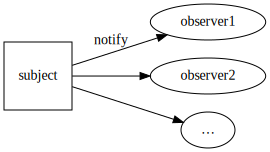

% Pushy Postgres and Python

# BrightLink {data-background="static/images/blmark.png" data-background-transition="slide"}

Help people prove themselves worthy

↓

Candidate/credential &amp;

Performance exam management

<aside class="notes">
<ul>
    <li>small business</li>
    <li>candidate &amp; credential management</li>
    <li>Python stack</li>
</ul>
</aside>

# {#why}

Start with

<h1>Why?</h1>

<aside class="notes">
You

> * *always on*, *social* users
> * scale out: throwing hardware at the problem only goes so far
> * more visibility w/o hurting performance

Me

> * love Python
> * love sharing knowledge
</aside>

tl;dr
=====

Use Postgres?

Get data-driven push notices in your distributed app for free!

❦,

`@drocco007`

<aside class="notes">
> * This is the one-slide version of this talk
> * add distrib. message processing with
> * data-driven push notices
> * no additional infrastructure, ops changes, etc.

Outline:

> * overview of Observer
> * Notify/Listen in PG
> * Case study
</aside>

# Demand<br/>DB

<aside class="notes">
    <ul>
        <li>Do username &amp; password match?</li>
        <li>How many people registered for event?</li>
        <li>Find email addresses for all users in OH</li>
    </ul>
</aside>

# Ubiquitous Connectivity

"Don't call us, we'll call you."

<aside class="notes">
    New paradigm
</aside>

# SQL?

Just imagine…

``` python

    while True:
        db.execute('SELECT are_we '
                   'FROM there_yet;')
        sleep(10)
```

<em class="fragment">(if all the apps on your phone did this…)</em>

# {#meltdown data-background="static/images/server_meltdown.png"}

<!-- -->


# You are here {data-background="#3b3132" data-background-transition="slide"}


# Are you watching closely?



<aside class="notes">
    <ul>
        <li>Observer pattern</li>
        <li>Subject: thing being observed</li>
        <li>Subject: doesn't need to know about observer purpose, #</li>
        <li>Encapsulate action from reaction</li>
        <li>Python's first-class functions makes this easy</li>
    </ul>
</aside>

# UI


<!-- end of list -->

    $("#action-btn").on("click", …)

# Django

<aside class="notes">
    auth.user_logged_in etc.

    models
</aside>

# SQLAlchemy

<aside class="notes">
    <ul>
        <li>session events</li>
        <li>attribute/model updates</li>
    </ul>
</aside>

# Tradeoffs

<aside class="notes">
    <ul>
        <li>decouple action from reaction: flexibility &amp; focus</li>
        <li>widely applicable</li>
        <li>can lead to complex interactions &amp; difficult to trace cascades</li>
    </ul>
</aside>

# * * *

<aside class="notes">
Postgres does this!

Look at how Postgres implements Observer
</aside>

# PostgreSQL: NOTIFY/LISTEN

<aside class="notes">
DB connected clients can

> * LISTEN on a message channel
> * NOTIFY other listeners of events
> * not directly tied to DB objects (relations, tuples, etc.)
</aside>

# Channeling

``` sql
LISTEN anything_good_on_this
```

<aside class="notes">
> * channel name is an *identifier*
> * 63 char effective limit (w/o recompilation), truncates
> * quoted names are case sensitive, unquoted names are not (!)
</aside>


# "Message for you, sir!"

``` sql
NOTIFY arthur_king_of_the_britons, 'ARROWED!'
```

# psql NOTIFY/LISTEN

<iframe src="pg.html" width="1024" height="585" style="overflow: hidden"></iframe>

# Transaction Interaction

``` sql
BEGIN;
NOTIFY unspeakable_thoughts, 'I''m reluctant to tell you this…'
ROLLBACK;
```

# Transaction Interaction

``` sql
LISTEN im_sorry_did_you_say_something;

BEGIN;

-- NOTIFY posted here

SELECT some_data FROM this_monster_view;
UPDATE table_with_a_zillion_indexes…;

COMMIT;

-- message delivered here
```

# Typical…

``` sql
CREATE FUNCTION new_user_handler() RETURNS TRIGGER AS $$
BEGIN
    EXECUTE 'NOTIFY new_user;';
    RETURN NULL;
END;
$$ LANGUAGE plpgsql;

CREATE TRIGGER app_user_trigger
AFTER INSERT ON app_user
      FOR EACH ROW EXECUTE PROCEDURE new_user_handler();
```

# Use Case

<aside class="notes">
    <ul>
        <li>async job processing</li>
        <li>separate from app server</li>
        <li>e.g. reports, batch/cleanup jobs, notifications</li>
    </ul>
</aside>

# Goals {data-background="#090b32" data-background-transition="slide"}


<aside class="notes">
    <ul>
        <li>keep UI responsive for tasks initiated by user</li>
        <li>minimize percieved impact on system</li>
    </ul>
</aside>

# Why [ ! $OTHER_TECH ]


<aside class="notes">Leverage existing infrastructure</aside>

# Data Proximity

Dovetail with TRIGGER

# Approach {data-background="static/images/stepping_stones.jpg" data-background-transition="slide"}

<aside class="notes">
    <ul>
        <li>user action/automated tasks create jobs</li>
        <li>job triggers notice</li>
        <li>worker farm picks up new job &amp; runs it</li>
    </ul>
</aside>

# Trigger Happy {data-background="#090909" data-background-transition="slide"}

<pre class="sourceCode sql">
<code class="sourceCode sql">
CREATE FUNCTION job_queued_handler() RETURNS TRIGGER AS $$
BEGIN
    EXECUTE 'NOTIFY job_queued, ''' || <span class="fragment visible highlight-green grow">NEW.queue_name</span> || ''';';
    RETURN NULL;
END;
$$ LANGUAGE plpgsql;

CREATE TRIGGER job_queued_trigger
AFTER INSERT ON job_queue
      FOR EACH ROW EXECUTE PROCEDURE job_queued_handler();
</code>
</pre>

<aside class="notes">NEW is the row that has been inserted</aside>

# PyListen {data-background="#090909" data-background-transition="slide"}

<pre class="sourceCode python">
    <code class="sourceCode python">
    <span class="fragment visible highlight-current-green">conn = psycopg2.connect(DSN)
    conn.set_isolation_level(ISOLATION_LEVEL_AUTOCOMMIT)
    cursor = conn.cursor()</span>

    <span class="fragment visible highlight-current-green">cursor.execute('LISTEN job_queue_control_message;')
    cursor.execute('LISTEN job_queued;')</span>

    while self.running:
        if <span class="fragment visible highlight-current-green">select.select([conn], [], [], 10) != ([], [], [])</span>:
            <span class="fragment visible highlight-current-green">conn.poll()
            while conn.notifies:
                notice = conn.notifies.pop()</span>
                <span class="fragment visible highlight-current-green">print("Got NOTIFY from PID {}: {} {}"
                      .format(notice.pid, notice.channel, notice.payload))</span>
    </code>
</pre>

# Get the Word Out {data-background="#090909" data-background-transition="slide"}

```python

    def dblisten(q):
        # connect/loop as above
        q.put(notice)

    @websocket.WebSocketWSGI
    def broacast_notify(ws):
        "Relay PG NOTIFY to WebSocket"

        q = eventlet.Queue()
        eventlet.spawn(dblisten, q)
        while True:
            notice = q.get()
            ws.send(unicode(notice.payload))

```

or gevent, ws4py, ∅MQ, Redis PUB/SUB, etc.

# Ideas

> * notify active subscribers
> * streaming monitoring/analytics
> * cache invalidation
> * µservice architecture

<aside class="notes">
>    * notify active user/post subscribers
>    * streaming analytics
>    * monitoring/event notification
>    * cache invalidation
>    * µservice architecture
>    * biz KPIs

</aside>


# Performance Notes

<aside class="notes">
>    * in production for 1.5+ years, millions of jobs
>    * many concurrent notices → $n^2$ notify performance
>        - mitigate w/ relay

</aside>

# ❦

`@drocco007`
